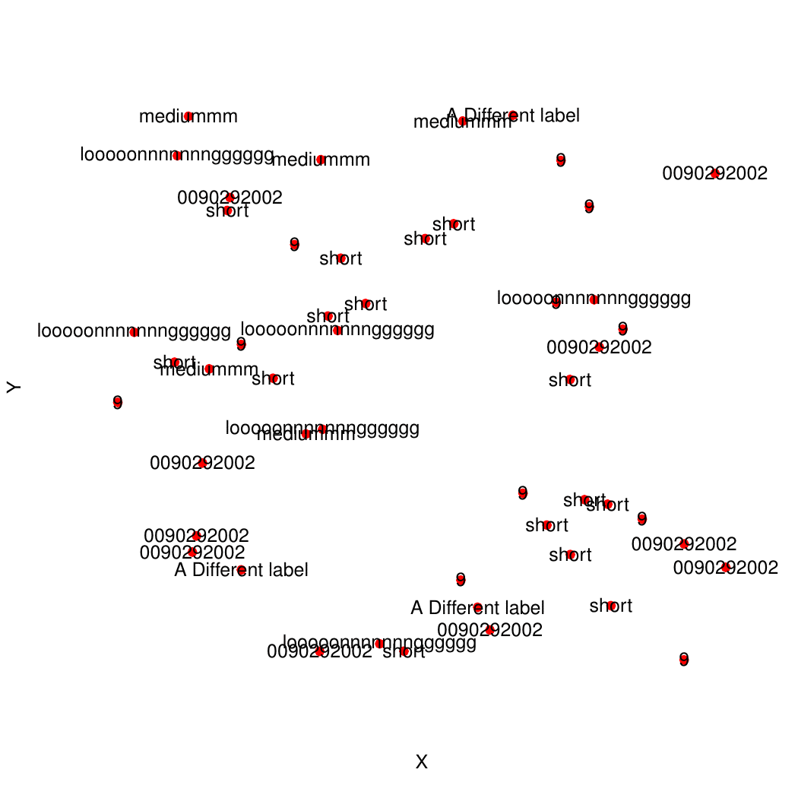
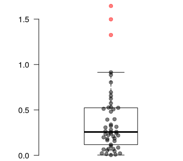
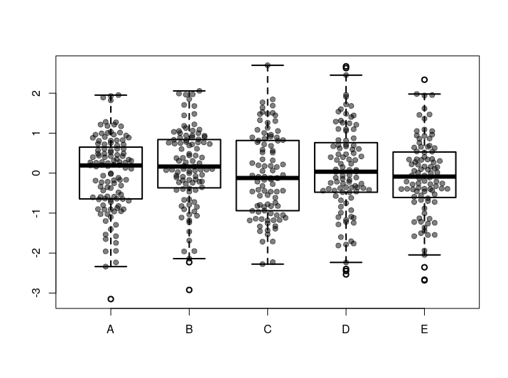
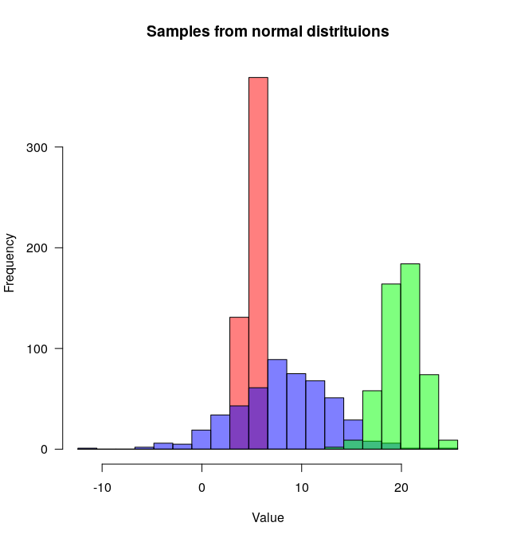
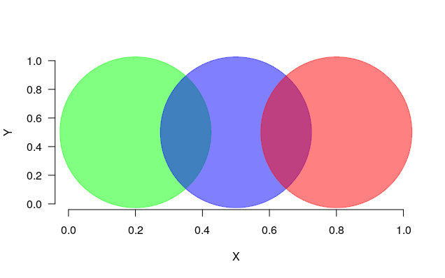
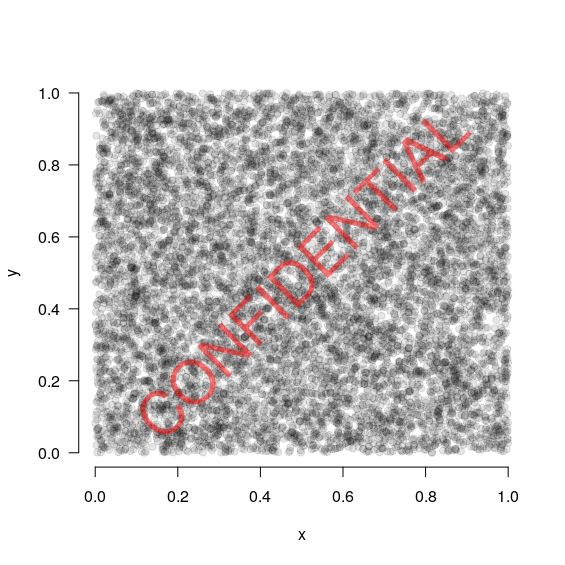
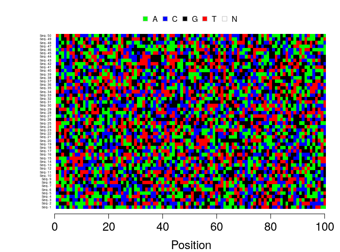
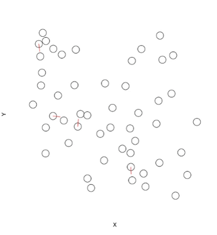
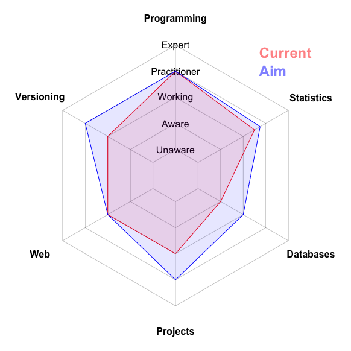

# basicPlotteR
## Author: Joseph Crispell
## Repository created: 23-04-19
## Licence: GPL-3
An R package containing all the functions I have developed to make plotting in R a little easier

Package can be directly installed into R using:
```
install.packages("devtools")
devtools::install_github("JosephCrispell/basicPlotteR")
library(basicPlotteR)
```

## Package contents
`basicPlotteR` is a collection of tools designed for particular tasks. As I develop different tools that help with plotting in R, I'll add them into this general package. These are the current tools available in `plotteR`:
- [`addTextLabels`](#addtextlabels) for adding non-overlapping labels onto existing R plot
- [`spreadPoints`](#spreadpoints) for adding points onto boxplot(s) that are deterministically spread out to minimise overlap
- [`plotMultipleHistograms`](#plotmultiplehistograms) for plotting multiple histograms on the same plot
- [`progress`](#progress) for running a progress bar within a for loop
- [`setAlpha`](#setalpha) for changing the alpha value (transparency) of colours specified as strings of characters
- [`watermark`](#watermark) for adding a transparent text label onto an existing plot
- [`plotFASTA`](#plotfasta) a quick way to visualise a nucleotide alignment
- [`addPoints`](#addpoints) for adding non-overlapping points onto existing R plot
- [`radarChart`](#radarchart) for create a skills radar chart to map skills status and progress

## `addTextLabels`
```
# Create some random points
n <- 50
testLabels <- c("short", "mediummm", "looooonnnnnnngggggg", "0090292002", "9", "A Different label")
coords <- data.frame(X=runif(n), Y=runif(n, min=0, max=100), Name=sample(testLabels, size=n, replace=TRUE),
                     stringsAsFactors = FALSE)

# Plot them without labels
plot(x=coords$X, y=coords$Y, pch=19, bty="n", xaxt="n", yaxt="n", col="red", xlab="X", ylab="Y")

# With potentially overlapping labels
plot(x=coords$X, y=coords$Y, pch=19, bty="n", xaxt="n", yaxt="n", col="red", xlab="X", ylab="Y")
text(coords$X, coords$Y, labels=coords$Name, xpd=TRUE)

# Plot them with non-overlapping labels
plot(x=coords$X, y=coords$Y, pch=19, bty="n", xaxt="n", yaxt="n", col="red", xlab="X", ylab="Y")
addTextLabels(coords$X, coords$Y, coords$Name, cex=1, col.label="black")

# Plot them with non-overlapping labels
plot(x=coords$X, y=coords$Y, pch=19, bty="n", xaxt="n", yaxt="n", col="red", xlab="X", ylab="Y")
addTextLabels(coords$X, coords$Y, coords$Name, cex=1, col.background=rgb(0,0,0, 0.75), col.label="white")
```



## `spreadPoints`
Adding points to single boxplot:
```
# Set the seed
set.seed(254534)

# Generate some example points - drawn from exponential distribution
values <- rexp(n=50, rate=2)
 
# Plot a boxplot
boxplot(values, xlab="",  ylab="", frame=FALSE, las=1, pch=19, outcol=rgb(1,0,0, 0.5),
        horizontal=FALSE)
        
# Plot the points spread along the X axis
spreadPoints(values, position=1)
```



Adding points to multiple boxplots:
```
# Set the seed
set.seed(254534)

# Generate some example points - drawn from normal distribution and randomly assign them to categories
randomSamples <- data.frame(Values = rnorm(500), Category = sample(c('A', 'B', 'C', 'D', 'E'), size=500, replace=TRUE))
 
# Plot a boxplot of the samples from the normal distribution versus there categories - multiple boxplots
boxplot(Values ~ Category, data = randomSamples, lwd = 2)
 
# Plot the points for each category spread along the X axis
spreadPointsMultiple(data=randomSamples, responseColumn="Values", categoriesColumn="Category")
```



## `plotMultipleHistograms`
```
# Set the seed
set.seed(254534)

# Create random samples from a normal distribution
distributions <- list(rnorm(500, mean=5, sd=0.5), 
                      rnorm(500, mean=8, sd=5), 
                      rnorm(500, mean=20, sd=2))

# Plot overlapping histograms
plotMultipleHistograms(distributions, nBins=20, colours=c(rgb(1,0,0, 0.5), rgb(0,0,1, 0.5), rgb(0,1,0, 0.5)), 
		       las=1, main="Samples from normal distribution", xlab="Value")
```



## `progress`
```
# Set the number of iterations of the for loop
n <- 1000

for(i in 1:n){
  
  # Sleep for a tenth of a second
  Sys.sleep(0.01)
  
  # Update the progress bar
  progress(i, n)
}
```


## `setAlpha`
```
# Define the coordinates of three points
x <- c(0.2, 0.5, 0.8)
y <- c(0.5, 0.5, 0.5)

# Define the colours for the points
colours <- c("green", "blue", "red")

# Plot the points - set the transparency
plot(x, y, bty="n", xlab="X", ylab="Y", las=1, pch=19, cex=30, xlim=c(0,1), ylim=c(0,1), 
     col=setAlpha(colours, alpha=0.5))
```



## `watermark`
```
# Generate some example data
x <- runif(10000)
y <- runif(10000)
 
# Plot the points
plot(x, y, las=1, bty="n", pch=19, col=rgb(0,0,0, 0.1))
 
# Add a watermark
watermark("CONFIDENTIAL", col="red")
```



## `plotFASTA`
```
# Create an example dataset
nSequences <- 50
nSites <- 100
alignment <- matrix(sample(c("A", "C", "G", "T"), nSequences*nSites, replace=TRUE),
                    nrow=nSequences, ncol=nSites)
rownames(alignment) <- paste("Seq-", 1:nSequences)

# Plot the FASTA
plotFASTA(alignment, xTicksCex = 1.5, xLabCex=1.5, sequenceLabelCex=0.4)
```



## `addPoints`
```
# Create some random points
n <- 50
coords <- data.frame(X=runif(n), Y=runif(n), Name="Test Label")

# Plot points and allow overlapping
plot(x=coords$X, y=coords$Y, bty="n", xaxt="n", yaxt="n", cex=3, xlab="X", ylab="Y")

# Plot points and avoid overlapping
plot(x=NULL, y=NULL, xlim=range(coords$X), ylim=range(coords$Y), bty="n", xaxt="n", yaxt="n", xlab="X", ylab="Y")
addPoints(coords$X, coords$Y, cex=3, col.line="red")
```



## `radarChart`
```
# Create a radar chart to map our current status for selected skills
radarChart(scores=c(4,3.5,2,3,3,3), 
           names=c("Programming", "Statistics", "Databases", "Projects",
                   "Web", "Versioning"),
           levels=c("Unaware","Aware","Working","Practitioner", "Expert"))

# Add to the radar chart where we aim to get to
radarChart(scores=c(4,3.75,3,4,3,4), 
           names=c("Programming", "Statistics", "Databases", "Projects",
                   "Web", "Versioning"),
           levels=c("Unaware","Aware","Working","Practitioner", "Expert"),
           polygon.col="blue", add=TRUE)

# Add a legend
legend("topright", 
       legend=c("Current", "Aim"), 
       text.col=c(rgb(1,0,0, 0.5), rgb(0,0,1, 0.5)), 
       bty="n", text.font=2, cex=1.5, xpd=TRUE)
```


